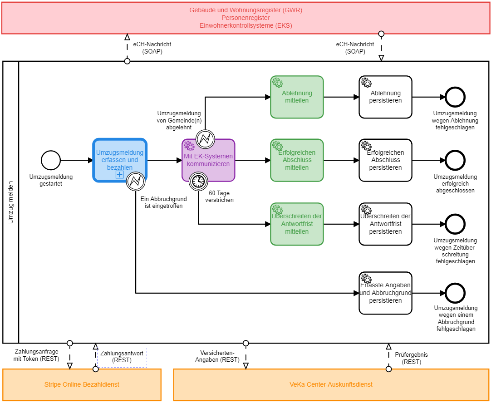

# eUmzug-Plattform 2018 (eumzug-plattform-2018)

> Autoren der Dokumentation: Björn Scheppler

> Dokumentation letztmals aktualisiert: 14.8.2018

> TOC erstellt mit https://ecotrust-canada.github.io/markdown-toc/

In diesem Projekt ist eine mögliche Lösung für den [UmzugsmeldepProzess](https://www.egovernment.ch/de/umsetzung/schwerpunktplan/e-umzug-schweiz/) entwickelt.

Die Lösung entstand im Rahmen des Moduls Geschäftsprozesssintegration im Studiengang Wirtschaftsinformatik an der ZHAW School of Management and Law basierend auf der Lösung vom HS 2017, aber architektonisch und technisch auf den Stand für HS 2018 gebracht.

## Inhaltsverzeichnis
  * [Architektur der Umzugsplattform inklusive Umsystemen](#architektur-der-umzugsplattform-inklusive-umsystemen)
  * [Komponenten und Funktionalitäten der Umzugsplattform](#komponenten-und-funktionalitaeten-der-umzugsplattform)

## Architektur der Umzugsplattform inklusive Umsystemen
Die Umzugsplattform benötigt für das Funktionieren verschiedene Komponenten, welche teilweise in der Umzugsplattform selbst (= das vorliegende Maven-Projekt) enthalten sind und teilweise extern.

Die **Haupt-Komponenten und ihr Zusammenspiel** sind in der untenstehenden Grafik abgebildet:

Die **Farben** bedeuten dabei:
- **Weiss/farblos**: Die eigentliche Umzugsplattform mit dem Hauptprozess, welche als Camunda Spring Boot-Applikation implementiert ist. Service Tasks, welche nicht eingefärbt sind, werden über JavaDelegates implementiert, User Tasks über Embedded Forms, die in der Camunda Webapp Tasklist eingebettet sind.
- **Blau**: Implementation als eigener Prozess innerhalb der Umzugsplattform, welcher über eine [Call Activity](https://docs.camunda.org/manual/7.9/reference/bpmn20/subprocesses/call-activity/) aufgerufen wird
- **Violett**: Implementation als Microservice-Applikation, welche die Umzugsplattform selbst auch als Camunda Spring Boot-Applikation implementiert ist.  Die Einbindung in den Hauptprozess geschieht über das [External Task Pattern](https://docs.camunda.org/manual/7.9/user-guide/process-engine/external-tasks/).
- **Grün**: Implementation als Microservice-Applikation, welche jedoch ohne Process Engine auskommen, sondern lediglich simple Spring Boot-Applikationen sind.
- **Rot**: Die rot eingezeichneten Systeme sind in einer produktiven Umgebung komplett in einer anderen Verantwortung als beim Kanton Bern, sprich bei den Gemeinden (Einwohnerkontrollsysteme EKS), dem Bund (GWR) oder einer anderen Kantonsstelle (Personenregister). Sie könnten entsprechend in irgendeiner Technologie implementiert sein. Für die Umzugsplattform relevant ist lediglich, dass diese über eine standardisierte Schnittstelle erreichbar ist, konkret über SOAP-Schnittstellen gemäss eCH-Standards.

Im Folgenden werden die einzelnen **Komponenten der Architektur aufgelistet und ihre Implementation begründet**:
1. **Umzug melden**: Dies ist der Hauptprozess, enthalten in der Umzugsplattform. Da wir auf eine eigene Tasklist-Applikation verzichten und stattdessen die Camunda Webapp Tasklist benutzen, muss der Benutzer bereits an dieser angemeldet sein, um überhaupt diesen Prozess starten zu können. Dies wäre in einer produktiven Applikation wohl nicht sinnvoll, würde aber aktuell wohl am ehesten dem Modell des Kantons Zürich mit den ZH Services entsprechen, wo man die Steuererklärung auch erst ausfüllen kann, wenn man sich an der Plattform angemeldet hat.
2. **GWR, Personenregister und EKS**: Diese Umsysteme müssen wir für unsere Demo-Zwecke mocken, also selbst irgendwie implementieren. GWR und Personenregister enthalten nur einfache Prozesse und auch keine User Tasks, daher verzichten wir auf den "Ballast" der Camunda Process Engine und implementieren sie als einfache Spring Boot-Applikationen. Das Einwohnerkontrollsystem hingegen hat zwar ebenfalls einen einfachen Prozess, aber beinhaltet einen User Tasks, benötigt also ein Eingabeformular - damit die Studierenden nicht noch eine Technologie mehr lernen müssen, wird das EKS über Camunda Spring Boot implementiert.
3. **Umzugsmeldung erfassen und bezahlen**: Dies ist derjenige Teil des Hauptprozesses, in welchem der Meldepflichtige über verschiedene Formulare sowie Anbindung von Umsystemen (GWR und Personenregister) die Umzugsmeldung erstellt. Dieser Teil wurde der Einfachheit halber bewusst nicht als eigenständiger Microservice ausgelagert, weil dies sonst dazu führen würde, dass der Benutzer mit zwei Tasklists agieren müsste (inkl. Anmeldung & Co.). In einem produktiven Szenario würde man allerdings ohnehin die Process Engine von der Tasklist-Applikation trennen, so dass dann ein Microservice geeignet wäre. Streng genommen wäre ein Embedded Subprocess auch ausreichend statt der nun gewählten Call Activity. Aber da der Camunda Modeler (noch) kein Verlinken von Teilprozessmodellen mit dem Hauptprozess erlaubt, kommt nur diese in Frage.
4. **Mit EK-Systemen kommunizieren**: In diesem Teil des Hauptprozesses erfolgt die automatisierte Kommunikation mit den Einwohner-Kontrollsystemen der Wegzugs-/Umzugs-/Zuzugsgemeinden. Da hier keine User Tasks vorhanden sind, spricht im Gegensatz zu *Umzugsmeldung erfassen und bezahlen* nichts gegen eine Auslagerung dieses Prozesses als Microservice. Wir haben dies auch im Hinblick darauf gewählt, weil es denkbar ist, dass nicht nur die Umzugsplattform mit den Einwohnerkontrollsystemen kommunizieren muss, sondern eine solche auch in anderen Prozessen des Kantons erforderlich ist (z.B. ???).
5. **Kantonaler Zahlungsdienst**: Dieser wird aus *Umzugsmeldung erfassen und bezahlen* aufgerufen. Es ist davon auszugehen, dass die Umzugsplattform nicht die einzige Online-Applikation des Kantons Berns ist, wo der Benutzer im Verlauf des Prozesses eine Dienstleistung bezahlen muss (z.B. für Nummernschild des Autos, usw.). Daher ist es sinnvoll, diesen Dienst von der Umzugsplattform auszulagern. Für eine möglichst grosse Unabhängigkeit soll dies als Microservice implementiert werden (daher keine Nachrichtenflüsse zum Hauptprozess), welcher jedoch aus Gründen eines umfassenden Loggings, der Möglichkeit von Transaktionen und dem Vorhandensein von User Tasks mit der Camunda Process Engine implementiert werden soll. Noch zu lösende Herausforderung: Wie gelingt es, dass der Benutzer der Umzugsplattform auf den User Task des völlig anderen Systems gelangt?
6. **Erfolgreichen Abschluss mitteilen**: Aufgrund der Komplexität - es sollen nebst Mail-Benachrichtigung z.B. auch SMS-Benachrichtigung ermöglicht werden -, ist eine Implementation nur als JavaDelegate nicht sinnvoll. Umgekehrt ist der Benachrichtigungsprozess selbst so trivial, dass eine eigene Process Engine nicht sinnvoll erscheint. Aus diesem Grund wird eine reine Spring Boot-Applikation entwickelt, aber als eigener Microservice, so dass diese Applikation auch von anderen Prozessen im Kanton Bern genutzt werden kann.
7. **Persistieren-Service Tasks**: Die verschiedenen Service Tasks wie z.B. *Erfolgreichen Abschluss persistieren*, welche in der Umzugsplattform-Datenbank die wichtigsten Angaben zur meldepflichtigen Person und zum Prozessstatus persistieren sollen, werden als JavaDelegate implementiert, da die Funktonalität ziemlich trivial ist. @heip: Wir könnten aber natürlich das auch etwas ausweiten, indem eine separate Applikation diese Persistierung vornimmt mit separater Datenbank (nicht Process Engine-DB) und dafür noch einem kleinen WebGUI, wo Angestellte der Verwaltung jederzeit für einen Meldepflichtigen seinen aktuellen Status anschauen können. Anderseits: Warum hierzu nicht einfach das Camunda Cockpit nutzen mit dem Filter nach einem bestimmten BusinessKey, welcher dem Benutzer auf dem "Abschlussbestätigung anzeigen"-Dialog angezeigt wird, damit er bei Telefonaten die richtige Id nennt?

## Komponenten und Funktionalitaeten der Umzugsplattform
1. Spring Boot 2.0.2 konfiguriert für Tomcat
2. Camunda Spring Boot Starter 3.0.0
3. Camunda Process Engine, REST API und Webapps (Tasklist, Cockpit, Admin) in der Version 7.9.2 (Enterprise Edition)
4. H2-Datenbank-Unterstützung (von Camunda Engine benötigt)
5. "Sinnvolle" Grundkonfiguration in application.properties für Camunda, Datenbank und Tomcat
