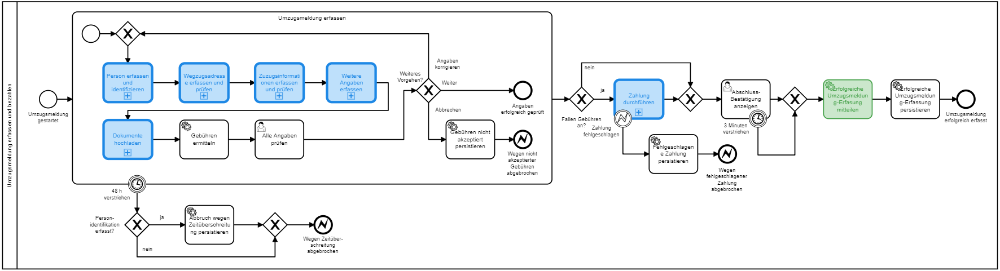

# eUmzug-Plattform 2018 (eumzug-plattform-2018)

> Autoren der Dokumentation: Björn Scheppler

> Dokumentation letztmals aktualisiert: 6.10.2019

> TOC erstellt mit https://ecotrust-canada.github.io/markdown-toc/

In diesem Projekt ist eine mögliche Lösung für den [UmzugsmeldeProzess](https://www.egovernment.ch/de/umsetzung/schwerpunktplan/e-umzug-schweiz/) entwickelt.

Die Lösung entstand im Rahmen des **Moduls Geschäftsprozesssintegration im Studiengang Wirtschaftsinformatik** an der ZHAW School of Management and Law basierend auf der Lösung vom HS 2017, aber architektonisch und technisch auf den Stand für HS 2018 gebracht. Im Oktober 2019 wurde sie auf Camunda 7.10 gebracht, jedoch bewusst nicht auf 7.11, da hierdurch zu viele Anpassungen im Frontend erforderlich wären.

## Inhaltsverzeichnis
  * [Anforderungsspezifikation und Aufgabenstellung](#anforderungsspezifikation-und-aufgabenstellung)
  * [Architektur der Umzugsplattform inklusive Umsystemen](#architektur-der-umzugsplattform-inklusive-umsystemen)
    + [Haupt-Komponenten und ihr Zusammenspiel](#haupt-komponenten-und-ihr-zusammenspiel)
    + [Umzugsplattform](#umzugsplattform)
    + [Personenregister sowie Gebäude- und Wohnungsregister](#personenregister-sowie-geb-ude--und-wohnungsregister)
    + [VeKa-Center-Auskunftsdienst](#veka-center-auskunftsdienst)
    + [Stripe-Online-Bezahldienst](#stripe-online-bezahldienst)
    + [Einwohnerkontrollsysteme (EKS)](#einwohnerkontrollsysteme--eks-)
    + [Kantonaler Benachrichtigungsdienst](#kantonaler-benachrichtigungsdienst)
  * [(Technische) Komponenten der Umzugsplattform](#-technische--komponenten-der-umzugsplattform)
  * [Vorbereitung für das Ausführen/Testen der Applikation](#vorbereitung-f-r-das-ausf-hren-testen-der-applikation)
    + [Voraussetzungen](#voraussetzungen)
    + [Deployment](#deployment)
  * [Ausführen/Testen der Applikation](#ausf-hren-testen-der-applikation)
    + [Manuelles Testen](#manuelles-testen)
    + [Semi-Manuelles Testen](#semi-manuelles-testen)
    + [Automatisiertes Testen](#automatisiertes-testen)
  * [Weitere prototypische Vereinfachungen](#weitere-prototypische-vereinfachungen)
  * [Mitwirkende](#mitwirkende)

## Anforderungsspezifikation und Aufgabenstellung
Dieses Projekt ist die Musterlösung für eine Aufgabenstellung, welche den Studierenden gestellt wurde. Die Aufgabenstellung (PDF), das BPMN-Modell der im nächsten Kapitel abgebildeten Architektur sowie die originalen eCH-Anforderungsdokumente sind im Ordner **src/docs** abgelegt.
Unter anderem befindet sich dort im Ordner **exception-handling** eine Excel-Datei als Musterlösung für verschiedene Ausnahmefälle und ihrer Behandlung. Diese Ausnahmefallbehandlungen sind soweit sinnvoll auch in den jeweiligen BPMN-Modellen implementiert.

## Architektur der Umzugsplattform inklusive Umsystemen
Die Umzugsplattform benötigt für das Funktionieren verschiedene Komponenten, welche teilweise in der Umzugsplattform selbst (= das vorliegende Maven-Projekt) enthalten sind und teilweise extern.

### Haupt-Komponenten und ihr Zusammenspiel
Die Haupt-Komponenten und ihr Zusammenspiel sind in der folgenden Grafik abgebildet. Die restlichen BPMN-Modelle sind in src\main\resources\processes enthalten. Was die unterschiedlichen **Farben** in diesen Modellen bedeuten, wird unterhalb der Grafik erläutert. Im Anschluss daran wird jede Hauptkomponente etwas ausführlicher beschrieben und ihre Implementation begründet.


Die **Farben** bedeuten dabei:
- **Weiss/farblos**: Die eigentliche Umzugsplattform mit dem Hauptprozess, welche als Camunda Spring Boot-Applikation implementiert ist. Service Tasks, welche nicht eingefärbt sind, werden über JavaDelegates implementiert, User Tasks über Embedded Forms, die in der Camunda Webapp Tasklist eingebettet sind.
- **Blau (Aufrufprozesse)**: Implementation als eigener Prozess innerhalb der Umzugsplattform, welcher über eine Call Activity aufgerufen wird.
- **Grün (Microservice)**: Implementation als Microservice-Applikation, welche lediglich simple Spring Boot-Applikationen sind. Die Einbindung in den Hauptprozess geschieht über das [External Task Pattern](https://docs.camunda.org/manual/7.9/user-guide/process-engine/external-tasks/).
- **Rot und Orange (Umsysteme per REST/SOAP)**: Die rot und orange eingezeichneten Systeme sind in einer produktiven Umgebung komplett in einer anderen Verantwortung als beim Kanton Bern, sprich bei den Gemeinden (Einwohnerkontrollsysteme EKS), dem Bund (GWR), einer anderen Kantonsstelle (Personenregister), einem privaten Anbieter mit öffentlichem Auftrag (VeKa-Center) oder einem komplett privaten Anbieter (Stripe). Sie könnten entsprechend in irgendeiner Technologie implementiert sein. Für die Umzugsplattform relevant ist lediglich, dass diese über definierte Schnittstellen erreichbar sind, konkret über SOAP-Schnittstellen (Rot) gemäss eCH-Standards oder über REST (Orange). Für Testzwecke sind diese Umsysteme gemocked, jeweils in einer eigenen Github-Repository verfügbar und dokumentiert.

### Umzugsplattform
1. **Umzugsplattform insgesamt**: Der Einfachheit halber umfasst die Plattform alle folgende Komponenten in einer Applikation, die produktiv teilweise separat deployed würden für eine bessere Skalierbarkeit:
    1. **Applikationsserver und Webserver**: Über Spring Boot wird automatisch ein In-Memory-Tomcat-Applikationsserver (inkl. Webserver) gestartet. PS: Ob Tomcat als Applikationsserver bezeichnet werden soll, wird im Detai [hier](https://javapipe.com/blog/tomcat-application-server/) erläutert.
    2. **Process Engine**: Darin eingebettet wird die Camunda Process Engine als Applikation ausgeführt und ist per REST von aussen zugreifbar. Sie umfasst nebst der BPMN Core Engine auch einen Job Executor für das Erledigen asynchroner Aufgaben (z.B. Timer).
    3. **Process Engine-Datenbank**: Da eine Process Engine eine State Machine ist, muss sie irgendwo den Status laufender als auch abgeschlossener Prozessinstanzen als auch Jobs persistieren können. Dies geschieht hier über eine File-basierte H2-Datenbank.
    4. **Umzugsplattform-Datenbank**: Gewisse Stammdaten (z.B. Liste aller Gemeinden) als auch ausgewählte Bewegungsdaten erfolgreich oder fehlgeschlagen abgeschlossener Prozessinstanzen werden in einer separaten Umzugsplattform-Datenbank gehalten (ebenfalls H2).
    5. **Tasklist-Applikation**: Damit der Meldepflichtige seine Meldung erfassen kann, wird eine Client-Applikation benötigt, die im Browser ausgeführt werden kann. Hierfür wird die ebenfalls in Tomcat ausgeführte Camunda Tasklist WebApp eingesetzt. In einer produktiven Lösung würde diese durch eine spezifisch für den Kanton Bern entwickelte Tasklist-Applikation ersetzt, welche über REST mit der Process Engine kommuniziert. Immerhin wurden daher die Tasklist-Webapp (und die übrigen Webapps) angepasst (deutsche Übersetzung, Logo und Farben, Stripe Checkout integriert) in einem eigenen WebJAR-Projekt. Details hierzu siehe https://github.com/zhaw-gpi/be-services-plattform.
    6. **Cockpit-Applikation**: Damit der Systemadministrator bei technischen Problemen und der Prozessverantwortliche aus Gründen des Monitorings und Controllings die laufenden und vergangenen Prozessinstanzen verwalten kann, wird die ebenfalls in Tomcat ausgeführte Camunda Cockpit Webapp genutzt.
2. **Hauptprozess 'Umzug melden'**:
    1. Dies ist der End-to-End-Prozess, welcher aus der Tasklist-Applikation heraus vom Meldepflichtigen gestartet wird (siehe Abbildung oben).
    2. Da wir auf eine eigene Tasklist-Applikation verzichten und stattdessen die Camunda Webapp Tasklist benutzen, muss der Benutzer bereits an dieser Webapp angemeldet sein, um überhaupt diesen Prozess starten zu können. Dies wäre in einer produktiven Applikation wohl nicht sinnvoll, würde aber aktuell wohl am ehesten dem Modell des Kantons Zürich mit den ZH Services entsprechen, wo man die Steuererklärung auch erst ausfüllen kann, wenn man sich an der Plattform angemeldet hat.
    3. Innerhalb des Hauptprozesses gibt es verschiedene Aktivitäten gemäss obiger Abbildung, die im Folgenden von links nach rechts erläutert werden.
3. **Aufrufprozess 'Umzugsmeldung erfassen und bezahlen'**:
    1. Dies ist derjenige Teil des Hauptprozesses, in welchem der Meldepflichtige über verschiedene Formulare sowie Anbindung von Umsystemen (GWR, Personenregister & VeKaCenter) die **Umzugsmeldung erstellt** (siehe Abbildung unten).
    2. Dieser Teil wurde der Einfachheit halber bewusst **nicht als eigenständiger Microservice ausgelagert**, weil dies sonst dazu führen würde, dass der Benutzer mit zwei Tasklists agieren müsste (inkl. Anmeldung & Co.). In einem produktiven Szenario würde man allerdings ohnehin die Process Engine von der Tasklist-Applikation trennen, so dass dann ein Microservice geeignet wäre.
    3. Streng genommen wäre statt einem über eine **Call Activity** aufgerufenen Prozess ein **Embedded Subprocess** passender. Denn dieser macht für sich alleine ohne Hauptprozess keinen Sinn, kann nun aber aus der Tasklist unsinnigerweise separat gestartet werden. Die nun gewählte Call Activity ist aber tool-bedingt erforderlich, weil der Camunda Modeler (noch) kein Verlinken von Teilprozessmodellen (Embedded Subprocesses) mit dem Hauptprozess erlaubt.
    4. Innerhalb des Aufrufprozesses werden weitere Aufrufprozesse ebenfalls über Call Activities eingebunden aus dem soeben genannten Grund. Was in den jeweiligen Prozessen und Aktivitäten gemacht wird, kann aus den ausführlichen **Element Descriptions** pro BPMN-Element entnommen werden (in Camunda Modeler z.B. im Properties-Panel sichtbar). Hier soll nur auf diejenigen Aktivitäten eingegangen werden, welche **mit anderen Komponenten kommunizieren**, welche weiter unten detaillierter erläutert werden:
        1.  **Person erfassen und identifizieren**: Hier geschieht u.a. eine Kommunikation mit der Komponente **Personenregister** über SOAP, implementiert über die Spring Webservice-Komponenten.
        2.  **Wegzugsadresse erfassen und prüfen** und **Zuzugsinformationen erfassen und prüfen**: Hier geschieht eine Kommmunikation mit der Komponente **Gebäude- und Wohnungsregister GWR**, ebenfalls über SOAP.
        3.  **Weitere Angaben erfassen**: Hier geschieht u.a. im Schritt **Grundversicherung prüfen** eine Kommunikation mit der Komponente **VeKa-Center-Auskunftsdienst** über REST.
        4.  **Zahlung durchführen**: Hier geschieht eine Kommunikation mit dem **Online-Bezahldienst Stripe**. Die Kommunikation geschieht über REST, implementiert einerseits client-seitig über die Stripe Checkout JavaScript-Library und server-seitig über die Stripe Java API Library.

4. **Aufrufprozess 'Mit EK-Systemen kommunizieren'**:
    1. In diesem Teil des End-to-End-Prozesses erfolgt die automatisierte Kommunikation mit den **Einwohner-Kontrollsystemen** der Wegzugs-/Umzugs-/Zuzugsgemeinden.
    2. Diese geschieht **asynchron**: Im Aufrufprozess wird dem gemockten Einwohner-Kontrollsystem per REST (in der Realität per SOAP) die Umzugsmeldung mitgeteilt. Umgekehrt wird eine REST-Schnittstelle nach aussen angeboten, an welche das Einwohner-Kontrollsystem die Antwortmeldung an die Umzugsplattform senden kann. Über Message Correlation wird diese dann der korrekten Prozessinstanz übergeben. 
    3. Details zur technischen Implementation können dieser Github-Repository-Dokumentation entnommen werden: https://github.com/zhaw-gpi/async-rest-messaging
5. **External Tasks 'xyz mitteilen'**:
    1. In diesem Teil des End-to-End-Prozesses (und auch teilweise in den aufgerufenen Prozessen) erfolgt die automatisierte **Ein-Weg-Kommunikation mit dem Meldepflichtigen**.
    2. Diese geschieht nicht direkt, sondern über einen Dienst (**Kantonaler Benachrichtigungsdienst**), welcher über das **External Task Pattern** in die Umzugsplattform eingebunden ist.
6. **JavaDelegate 'xyz persistieren'**:
    1. In diesem Teil des End-to-End-Prozesses (und auch teilweise in den aufgerufenen Prozessen) erfolgt die automatisierte **Persistierung von Personendaten und Prozessstatus in der Umzugsplattform-Datenbank**.
    2. Diese Persistierung geschieht **über eine in der Umzugsplattform integrierte JavaDelegate-Klasse**, welche auf die Repositories zugreift.


### Personenregister sowie Gebäude- und Wohnungsregister
1. Diese Umsysteme sind für unsere Demo-Zwecke **gemockt**, wären aber in der Realität beim Bund (Gebäude- und Wohnungsregister) oder Kanton (Personenregister).
2. Sie enthalten nur **einfache Prozesse und auch keine User Tasks**, daher sind sie als **einfache Spring Boot-Applikationen** implementiert. In der Realität sind dies vermutlich recht umfassende IT-Systeme.
3. Diese Umsysteme kommunizieren mit der Aussenwelt, also auch unserer Umzugsplattform, über **SOAP**.
4. Die detaillierte Dokumentation zu den gemockten Systemen ist zu finden in folgenden **Github-Repositories**:
    1. Personenregister: https://github.com/zhaw-gpi/personenregister-2018
    2. Gebäude- und Wohnungsregister: https://github.com/zhaw-gpi/gwr-2018

### VeKa-Center-Auskunftsdienst
1. Auch dieses Umsystem ist **gemockt**. In der Realität wird das System von einem privaten Anbieter betrieben wird, welcher im Auftrag des Bundes tätig ist.
2. Die Kommunikation mit der Aussenwelt geschieht über REST.
3. Die detaillierte Dokumentation ist zu finden in folgender **Github-Repository**: https://github.com/zhaw-gpi/vekacenter

### Stripe-Online-Bezahldienst
1. Mit **Stripe** existiert ein Bezahldienst, der für Entwickler **zum Testen gratis** genutzt werden kann.
2. Dieses System müssen wir daher nicht mocken, sondern können den **realen Bezahldienst** out-of-the-box nutzen.
3. Nebst Stripe gäbe es auch **andere Anbieter und Architekturen**, welche z.B. [hier](https://medium.com/get-ally/how-to-architect-online-payment-processing-system-for-an-online-store-6dc84350a39) und [hier](https://dreamproduction.com/kreditkarten-ihrem-onlineshop-zahlungsloesungen-und-payment-anbieter-im-vergleich/) beschrieben sind. Stripe hat den Vorteil, dass es relativ einfach zu implementieren ist.

### Einwohnerkontrollsysteme (EKS)
1. Diese Umsysteme müssen wir wieder für unsere Demo-Zwecke **mocken**, also selbst irgendwie implementieren.
2. In der **Realität** sind solche EKS in der Regel **Module in umfassenden Gemeindesoftware-Paketen**. Zwei Bekannte sind etwa [Loganto von VRSG](https://www.abraxas.ch/de/loesungen/fachanwendungen/subjekte) oder [NEST](https://www.nest.ch/).
3. Daraus benötigen wir **gemocked lediglich einen Teil**, wo es um die Verwaltung von Zuzug/Wegzug/Umzug geht.
4. In der Realität muss in diesem Prozess mindestens ein Schritt sein, der von einem Menschen durchgeführt wird, welcher also die erhaltene Umzugsmeldung manuell prüft. Dies wird hier lediglich gemockt durch einen Zufallsgenerator für die Zeit, bis eine Antwort an die Umzugsplattform gesendet wird. Die Entscheidung selbst wird durch einen einfachen Algorithmus "berechnet" (Vorname beginnt mit A-M => Angenommen).
5. In der Realität haben wir es **nicht bloss mit einem EKS zu tun**, sondern mit sovielen, wie der Kanton Bern Gemeinden hat. Entsprechend würde es in der Umzugsplattform oder ausserhalb davon einen Routing-Service benötigen, welcher zur ID der Gemeinde die passende URL für den WebService des zugehörigen EKS zurück gibt. Darauf wird verzichtet.
6. Hinzu kommt, dass bei einem Wegzug/Zuzug zwei Gemeinden je diesen akzeptieren müssen, während im Prototoyp vereinfacht nur umgesetzt ist, dass eine Gemeinde ein Urteil fällt.
7. Die detaillierte Dokumentation ist zu finden in folgender **Github-Repository**: https://github.com/zhaw-gpi/einwohnerkontrollsystem

### Kantonaler Benachrichtigungsdienst
1. Aufgrund der **Komplexität** - es sollen nebst Mail-Benachrichtigung z.B. auch SMS-Benachrichtigung ermöglicht werden -, ist eine Implementation nur als JavaDelegate direkt in der Umzugsplattform nicht sinnvoll.
2. Vor allem wäre eine in die Umzugsplattform eingebettete Komponente auch deshalb wenig sinnvoll, weil wohl nicht bloss im "Umzug melden"-Prozess Mitteilungen zu versenden sind, sondern **auch in anderen Prozessen des Kantons Bern**.
3. Umgekehrt ist der Benachrichtigungs**prozess trivial**, so dass eine eigene Process Engine nicht sinnvoll erscheint. Zumal ja schon im Hauptprozess nachvollziehbar persistiert wird, wer über was benachrichtigt wurde.
4. Aus diesem Grund wird eine "einfache" **Spring Boot-Applikation ohne Camunda als Microservice** entwickelt.
5. Die Kommunikation der Umzugsplattform mit diesem Microservice geschieht über das von Camunda bereitgestellte  **External Task Pattern**.
6. Die Dokumentation des kantonalen Benachrichtigungsdienstes ist zu finden in folgendem **Github-Repository**: https://github.com/zhaw-gpi/kantonaler-benachrichtigungsdienst

## (Technische) Komponenten der Umzugsplattform
Nach der Beschreibung der Gesamtarchitektur mit den einzelnen Komponenten folgt nun eine technische Beschreibung der Komponenten in der Umzugsplattform (Maven-Projekt) selbst (vorliegende GitHub-Repository):

1. **Camunda Spring Boot Starter**:
    1. Spring Boot-Standardkonfiguration mit Tomcat als Applikations- und Webserver
    2. Camunda Process Engine, REST API und Webapps (Tasklist, Cockpit, Admin) in der Enterprise Edition, wobei für die Webapps zusätzlich ein eigenes WebJAR-Projekt aus dem lokalen Maven-Repository geladen wird.
    3. Main-Methode in EumzugPlattform2018Application-Klasse
2. **Prozess-Komponenten**:
    1. @EnableProcessApplication-Annotation in EumzugPlattform2018Application-Klasse
    2. processes.xml mit minimaler Konfiguration der Prozessapplikation
    3. Ordner processes mit allen BPMN-Modellen
    4. Package processdata für POJOs, welche Objekte instanzieren, die nicht zu persistieren sind
    5. Package delegates mit JavaDelegate-Klassen, die von den Prozessen aufgerufen werden, um entweder direkt etwas zu tun oder als Vermittler zu anderen Serivces & Co. zu dienen (z.B. zu LocalPersonIdGeneratorService).
3. **Persistierungs-Komponenten**:
    1. JDBC-Komponente als Treiber
    2. H2-Datenbank-Unterstützung inklusive Console-Servlet über application.properties-Einstellung
    3. Java Persistence API (JPA) inklusive EumzugPlattform2018Model.jpa-Diagramm (von Jeddict erstellt)
    4. Package Repositories und Package entities für Municipality, Person, TransactionLog, Status und Document
    5. JavaDelegates GetDocumentsDelegate, GetFeesDelegate, GetMunicipalityListDelegate und PersistUserEntriesAndStatusDelegate
    6. initialData.sql/xlsx in test/ressources, um die Datenbank initial mit sinnvollen Stammdaten zu füllen
4. **WebService SOAP-Komponenten**:
    1. Spring Boot Webservices-Komponenten für den Aufruf von SOAP-Services
    2. GenericWebServiceClientConfiguration-Klasse
    3. WebServiceHeaderActionCodeEnumeration-Klasse
    4. Package webserviceclients
    5. JAXB-Maven-Plugin, welches aus der Angabe der WSDL-URL automatisch Klassen generiert (eCH und gwr)
    6. Package helpers mit Helferlein-Klassen
    7. WebServiceHeaderActionCodeEnumeration-Klasse
    8. Endpoint-Deklarationen für GWR und Personenregister in application.properties
5. **WebService REST-Komponenten**:
   1. Spring Boot Webapplikations-Komponenten für den Aufruf von REST-Services (RestTemplate) und das Anbieten von REST-Endpoints
   2. Um auf die Daten der Umzugsplattform (nicht die Camunda Process Engine) zuzugreifen, wurde eine separate REST-API erstellt (Umzugsplattform-API) in DocumentRestController, MunicipalityRestController und TransactionLogController
   3. Dieselbe API enthält auch den TechnicalReceiptRestController, welcher durch die Einwohnerkontrollsysteme als Callback aufgerufen wird.
6. **Zahlungsabwicklungs-Komponenten**:
    1. Stripe Java API Library für die server-seitige Kommunikation mit Stripe
    2. StripeClientService-Klasse als Vermittler zwischen der API Library und ...
    3. CreateChargeDelegate-Klasse
    4. ErfassenDerZahlungsdetailsForm.html inklusive Verweis auf die Stripe Checkout JavaScript-Library
7. **Frontend-Komponenten**:
    1. Die bereits erwähnte Camunda Tasklist App, welche AngularJS, Bootstrap und das Camunda Forms SDK beinhaltet
    2. Camunda Spin (inklusive Jackson), um von/nach JSON zu (de-)serialisieren
    3. Ordner static/forms mit allen Embedded Forms-HTML-Dateien, welche den HTML-Code für die Forms sowie JavaScript-Code enthalten
8. "Sinnvolle" **Grundkonfiguration** in application.properties für Camunda, Datenbank und Tomcat
9.  Ein **soapUI-Testprojekt** in test/ressources/EumzugPlattform2018Tests-soapui-project.xml

## Vorbereitung für das Ausführen/Testen der Applikation
### Voraussetzungen
1. **Laufende Umsysteme**: Die Maven-Projekte Personenregister sowie Gebäude- und Wohnungsregister müssen gestartet sein. Die Maven-Projekte Einwohnerkontrollsystem, Kantonaler Benachrichtigungsdienst sowie VeKa-Center-Auskunftsdienst sollten gestartet sein. Details zur Ausführung siehe in den ReadMe der verlinkten Github-Repositories.
2. **Camunda Enterprise**: Wenn man die Enterprise Edition von Camunda verwenden will, benötigt man die Zugangsdaten zum Nexus Repository und eine gültige Lizenz. Wie man diese "installiert", steht in den Kommentaren im pom.xml.
3. **Stripe-Konto und -Konfiguration**: Damit man den Stripe-Online-Bezahldienst nutzen kann, benötigt man einen Public Key und einen Secret Key. Beides erhält man nur, wenn man ein kostenloses Konto bei Stripe eröffnet. Details stehen etwa [hier](https://medium.com/oril/easy-way-to-integrate-payments-with-stripe-into-your-spring-boot-angular-application-c4d03c7fc6e) beschrieben. Im Wesentlichen sind die Schritte:
    1. Konto erstellen mit einer gültigen E-Mail-Adresse.
    2. Den Bestätigungslink in der erhaltenen Mail ausführen
    3. Sich anmelden bei https://dashboard.stripe.com/
    4. NICHT auf "Activate your account" klicken, solange man es nur zum Testen verwenden will.
    5. In der [API Keys-Seite](https://dashboard.stripe.com/account/apikeys) die beiden Schlüssel herauskopieren
    6. Den Publishable Key in /src/main/ressources/static.forms/ErfassenDerZahlungsdetailsForm.html im Code unter `var stripeCheckoutHandler = StripeCheckout.configure({` beim Parameter key einfügen
    7. Den Secret Key als Umgebungsvariable hinzufügen, wie dies in /src/main/ressources/application.properties beim Eintrag `stripe.apiKey` im Kommentar beschrieben ist.
4. **Angepasste Camunda Webapps**: Das Projekt https://github.com/zhaw-gpi/be-services-plattform muss gemäss der dort aufgeführten Anleitung konfiguriert und gebuilded sein, damit es im lokalen Maven-Repository zur Verfügung steht.
5. **Umgebungsvariablen**: Folgende Umgebungsvariablen müssen gesetzt sein, damit das Projekt ausgeführt werden kann. Gezeigt ist die Darstellung, wie sie in VS Code in der launch.json-Datei eingefügt werden muss:
```
"env": {
                "stripeSecretKey": "sk_test_OMnaCgZa0FVQp9rjtA93I1zk",
                "stripePublicKey": "pk_test_YM8GGxfywicmmBgtFcOjEm00",
                "paymentreportreceiver": "scep@zhaw.ch",
                "umzugsplattformMailaddress": "umzugsplattform@be.ch"
            }
```

### Deployment
1. **Erstmalig** oder bei Problemen ein `mvn clean install` durchführen
2. Bei Änderungen am POM-File oder bei **(Neu)kompilierungsbedarf** genügt ein `mvn install`
3. Für den **Start** ist ein `java -jar .\target\NAME DES JAR-FILES.jar` erforderlich. Dabei wird Tomcat gestartet, die Datenbank bei der ersten Ausführung erstellt und mit initialen Daten gefüllt, respektive bei zukünftigen Starts hochgefahren, Camunda mit den Prozessen und den Eigenschaften (application.properties) hochgefahren.
4. Das **Beenden** geschieht mit **CTRL+C**
5. Falls man die bestehenden **Prozessdaten nicht mehr benötigt** und die Datenbank inzwischen recht angewachsen ist, genügt es, die Datei DATENBANKNAME.mv.db im Wurzelverzeichnis des Projekts zu löschen.

## Ausführen/Testen der Applikation
### Manuelles Testen
1. In http://localhost:8081 mit dem Benutzer a und Passwort a **anmelden**.
2. **Tasklist**-App starten.
3. Start Process > **Umzug melden** wählen.
4. Dann **durchspielen**, wie dies auch ein Benutzer machen würde mit folgenden **Testhinweisen**:
    1. **Personendaten im Personenregister**:
        1. Entweder selbst nachschlagen in der **H2-Datenbank-Konsole** oder folgende Werte verwenden.
        2. **Umzugsberechtigt mit Familienmitgliedern** ist: Hans, Meier, 1.1.1970, männlich
        3. **Umzugsberechtigt ohne Familienmitglieder** ist: Pipi, Langstrumpf, 1.1.1960, weiblich
        4. **Nicht umzugsberechtigt** ist: Ruth, Meier, 1.1.1980, weiblich
    2. **Adressen im Gebäude- und Wohnungsregister**:
        1. Entweder selbst nachschlagen in der **H2-Datenbank-Konsole** oder folgende Werte verwenden.
        2. Für jede PLZ im Kanton Bern (z.B. 3127 Lohnstorf oder 3073 Gümligen) sind zwei Adressen erfasst:
            1. **Bahnhofstrasse 1**
            2. **Dorfstrasse 13a**
    3. **E-Mail-Adresse bei Kontaktangaben**: Wenn man wirklich eine Mail erhalten möchte und mail.debug nicht auf true gesetzt ist, dann muss hier die eigene Mail-Adresse angegeben werden.
    4. **Grundversicherung prüfen**: Hinterlegt sind folgende vier Karten:
        1. 360269466985268: Gehört zu Hans Meier, ist aber 2016 abgelaufen.
        2. 743794085316616: Gehört zu Hans Meier und ist gültig
        3. 788475892684035: Gehört zu Anna Meier und ist gültig, aber nicht grundversichert
        4. 596947027238113: Gehört zu Annaliese Meier und ist gültig und grundversichert
    5. **Zahlungsdetails**:
        1. Für das Testen von Stripe Checkout kann man eine beliebige CVC verwenden und je nach gewünschtem Testergebnis ein Datum in der Zukunft oder Vergangenheit.
        2. Je nachdem, welches Testergebnis man wünscht, gibt es die verschiedensten Kartnnummern, welche [hier](https://stripe.com/docs/testing#cards) aufgelistet sind. Die wohl am häufigsten benötigten sind:
            1. 4000007560000009: Gültige in der Schweiz ausgestellte Visa-Karte
            2. 5555555555554444: Gültige amerikanische Mastercard-Karte
            3. 4100000000000019: Aus Sicht des Kartenherausgebers gültige Karte, die aber von Stripe aufgrund Betrugsverdacht blockierte Karte
            4. 4000000000000002: Vom Kartenherausgeber abgelehnte Karte ohne Angabe von Gründen
    6. **Zahlungserfolg prüfen**: Um zu sehen, ob eine Zahlung auch "wirklich" durchgeführt wurde, bei Stripe anmelden und die [Events-Seite](https://dashboard.stripe.com/test/events) aufrufen.
    7. **Persistierung prüfen**: Um zu sehen, ob ein Status im Transaktionslog der Umzugsdatenbank persistiert wurde, einen SELECT auf die Tabelle TRANSACTIONLOG durchführen
    8. **Prozessverlauf überwachen/nachvollziehen**: Um zu sehen, wo der Prozess momentan steckt (Runtime) oder wo abgeschlossene Instanzen durchliefen (History) kann die Cockpit-Webapplikation genutzt werden unter http://localhost:8081.

### Semi-Manuelles Testen
In src\test\resources gibt es ein soapUI-Testprojekt. Im Knoten http://localhost:8081/rest/process-definition/key/UmzugMelden/start gibt es mehrere POST-Requests. Führt man diese aus, wird eine neue Prozessinstanz für den UmzugMelden-Prozess gestartet, welcher schon Variablen übergeben wurden. Insbesondere der Request "TestdatenFuerKorrekturDerArbeiten" erlaubt ein Durchspielen, fast ohne, dass man in den Formularen etwas ausfüllen müsste. Ausnahmen davon sind:
1. Mitumziehende Personen auswählen: Anna und Fritz
2. Versicherungs-Kartennummern erfassen:
   1. Hans erfolgreich: 743794085316616 / Hans nicht erfolgreich: 360269466985268
   2. Anna: 788475892684035
   3. Fritz (hat keine hinterlegt): 00899988800
3. Dokumente hochladen: Man kann, muss aber nicht irgendwelche Dokumente bei den einzelnen Personen hochladen
4. Erfassen der Zahlungsdetails:
   1. Kreditkartennummer: 4000007560000009 (falls es funktionieren soll) / 4100000000000019 (falls es nicht funktionieren soll)
   2. Datum: in der Zukunft
   3. CVC: z.B. 333
5. Ganz am Schluss, wenn man möchte, noch http://localhost:8070/vekaapi/v1/cards/743794085316616 aufrufen, um zu beweisen, dass im VeKa-Center-Dienst nun die neue Adresse aufgeführt ist. Und natürlich auch im Posteingang zeigen, dass eine E-Mail angekommen ist.

### Automatisiertes Testen
Für einen Teil der Umzugsplattform-API gibt es eine TestSuite im soapUI-Testprojekt, welches im vorherigen Kapitel genannt wurde. Ursprünglich waren auch Testfälle vorhanden für die Umzugsplattform, aber da diese aufgrund einer veränderten Struktur nicht mehr laufen, wurden sie gelöscht.

## Weitere prototypische Vereinfachungen
Etliche prototypische Vereinfachungen wurden bereits im Text oben erwähnt. Aber es gibt noch mehr...

1. **Session-Handling, Benutzerverwaltung, usw.**: In der Realität müssen sich Meldepflichtige nicht anmelden (und damit zunächst registrieren), sondern können eine Meldung auch ohne Anmeldung starten. Unter Verwendung von Camunda Webapps mit User Tasks muss aber ein Benutzer angemeldet sein, damit er den Prozess starten kann und damit ihm Tasks zugewiesen werden können. Wir ignorieren dies und stattdessen ist der Meldepflichtige stets der Benutzer "a", was natürlich dann Probleme gibt, wenn gleichzeitig mehrere Prozessinstanzen laufen, denn dann werden diesem mehrere/verschiedene Aufgaben zugewiesen. Da Name, Vorname, AHV-Nummer, usw. pro Prozessinstanz unterschiedlich ist, sollte es aber dennoch möglich sein, das im Griff zu haben (siehe auch nächster Punkt). PS: In der Realität wäre die Umzugsplattform mit einer Authentifizierungsplattform verbunden wie Keycloak oder einem LDAP.
2. **Page Flow vs. BPMN Flow**: In der Realität würde der Meldepflichtige ein Formular nach dem anderen ausfüllen INNERHALB von einem einzigen User Task (oder einem Subprocess), denn so wie es jetzt ist, also verteilt über mehrere User Tasks, erzeugt jedes ausgefüllte Formular einen Eintrag in der Tasklist und der Benutzer benötigt daher a) zwingend eine Tasklist und b) muss er nun nach jedem Schritt auf die Aufgabe klicken anstatt dass das nächste Formular automatisch angezeigt wird und c) sollte man in der Realität natürlich im Browser zurück springen können zu einem vorherigen Formular. In der Realität könnte dies z.B. über einen JSF-PageFlow innerhalb des User Tasks gelöst werden. StephenOTT hat [hier](https://forum.camunda.org/t/chaining-user-tasks-to-create-an-interactive-flow-sort-of-a-wizard-style/613/9) gut dargelegt, dass wenn es darum geht, Page Flows (Wizards) abzubilden, ein BPMN-Flow (wie hier umgesetzt) keine geeignete Form ist (allenfalls für das Dokumentieren, aber nicht ausführbar), sondern dann würde man eher eine Lösung wie den form.io-FormBuilder im wizard-Modus nutzen.
3. Beim Umsystem **Personenregister** wird in der Realität die municipalityId und municipalityName vermutlich deshalb mitgeliefert, weil eine Person in mehreren Gemeinden registriert sein kann (Hauptwohnsitz und Wochenaufenthalter). Das heisst, moveAllowed müsste eigentlich bei der Beziehungstabelle sein zwischen Municipality und Resident. Dies mit JPA umzusetzen, ist gar nicht so einfach, u.a. braucht es dann eine eigene Entität für diese Beziehungstabelle mit einem Pseudo-Primärschlüssel: https://www.thoughts-on-java.org/many-relationships-additional-properties/. Daher lassen wir dies weg.
4. **Schema Validation**: Mit @SchemaValidation bei der Webservice-Endpoint-Klasse werden im Prototyp lediglich Standard-Fehlermeldungen ausgegeben, nicht aber benutzerdefinierte. Das ist ok bei einem Prototyp. Störender ist, dass XJC keine Annotations für die XSD-Restrictions hinzufügt (also, dass z.B. ein String nicht leer oder länger als 40 Zeichen sein darf). Es gibt teilweise Plugins, aber die sind seit mehreren Jahren nicht mehr aktualisiert => man müsste entweder ein eigenes Plugin schreiben oder aber die Annotations in den generierten Java-Klassen von Hand hinzufügen, aber dann wäre die Generierung im Build-Prozess natürlich nicht mehr opportun.
5. **PDF generieren mit Abschlussbestätigung**: Dies wird im realen eUmzug gemacht, aber darauf haben wir verzichtet.
6. **Zusatzdienste erfassen**: Also z.B. Parkkarten oder Hundedaten können im realen Prozess zusätzlich erfasst werden.
7. **Dokumente hochladen**: Bei mitumziehenden Personen muss nur die Hauptperson aktuell Dokumente hochladen, was in der Realität nicht zutreffend ist.
8. **Daten aufräumen**: Auf keinen Fall sollen Prozessvariablen wie z.B MunicipalityList persistiert werden, welche Stammdaten enthalten oder nur Hilfsvariablen, aber aktuell ist dies der Fall.

## Mitwirkende
1. Björn Scheppler: Hauptarbeit
2. Peter Heinrich: Der stille Support im Hintergrund mit vielen Tipps sowie zuständig
für den Haupt-Stack mit SpringBoot & Co.
3. Raphael Schertenleib: Etliche Formulare
4. Studierende aus dem Herbstsemester 2017:
    1. Gruppe TZb02 (Bekim Kadrija, Jovica Rajic, Luca Belmonte, Simon Bärtschi, Sven 
    Baumann):
        1. Formulare: DatePicker mit Format TT.MM.JJJJ
        2. Mitzuziehende Personen auswählen
        3. Dokumente hochladen
        4. PDF mit allen relevanten Informationen wird als E-Mail-Anhang mitgesendet (inzwischen wieder gelöscht)
        5. Kleinere Verbesserungen an der originalen Musterlösung
    1. Gruppe TZa02 (Alessandro Paradiso, Davor Gavranic, Lars Günthardt, Luka Devcic,
    Robin Chahal):
        1. Wohnungen auswählen
        2. Kleinere Verbesserungen an der originalen Musterlösung
    1. Gruppe TZa03 (Christian Sonntag, Felix Huber, Lukas Brütsch, Tamara Wenk, Vladan 
    Jankovic):
        1. Formulare: Mehrspaltiges Layout
        2. Formulare: Placeholders
        3. Formulare: Bessere Alert- und Help Block-Texte
    1. Gruppe TZb05 (Arbr Wagner, Christoffer Brunner, Leulinda Gutaj, Martin Schwab, 
    Saskia Iwaniw): Formular "Alle Angaben prüfen"
5. Studierende aus dem Herbstsemester 2018:
   1. Gruppe TZa02 (Daniel Degenhardt, Luca Spänni, Stefan Glättli, Tobias Brunner, Didier Furrer):
      1. Separate Webapplikation, um die Meldepflichtigen zu verwalten (wieder gelöscht)
   2. Gruppe TZa03 (Fabio Gihr, Timothy Locher, Yanik Pfenninger, Kisanth Ketheeswaran, Lucky Bassi):
      1. Grundversicherungsprüfung direkt aus dem Formular heraus
   3. Gruppe TZb01 (Lukas Gollmer, Alexander Petermaier, Jan Hartmann, Dominik Spescha, Michael Zbinden, Olivier Alther):
      1. Dokumente hochladen elegant in einem Formular für alle mitumziehenden Personen
   4. Gruppe TZb05 (Patrick Schönenberger, Stefan Kaufmann, Aleksandar Todorovic, Stefan Fischer):
      1. Separate Datenbank für Umzugsplattform vs. Process Engine
   5. Gruppe TZc01 (Fabio Serratore, Sven Schwarzer, Christof Schuh, Luca Saletta, Pascal Schoch, Stefan Gautschi):
      1. Buchhaltungsabteilung wird einmal monatlich informiert über eingegangene Zahlungen von Stripe (inzwischen wieder gelöscht)
   6. Gruppe TZc03 (Janick Spirig, Adrian Meier, Leo Rettich, Emir Odic, Timo Graf):
      1. Dokumente hochladen elegant in einem Formular für alle mitumziehenden Personen,    
   7. Gruppe TZc05 (Jascha Pfäffli, Rehmil Sabani, Egzon Murtaj, Dardan Sylejmani):
      1. Dokumente hochladen elegant in einem Formular für alle mitumziehenden Personen
   8. Gruppe VZa02 (Dario Burch, Aleksandar Sekulic, Ilija Kurobasa, Gregory Huber, Blerton Ismaili, Marvin Bindemann):
      1. Separate Webapplikation, um die Meldepflichtigen zu verwalten (wieder gelöscht)    
   9.  Gruppe VZb02 (Simon Degiorgi, Thomas Landolt, Romeo Weber, Martin Knecht, Manuel Weiss, Janick Michot):
      2. Dokumente hochladen elegant in einem Formular für alle mitumziehenden Personen